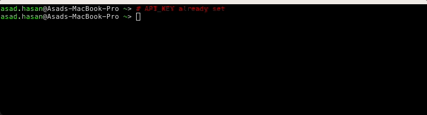

# Cricket live scores cli

Basic CLI to stream live cricket scores (via cricket-live-scores API, which does require a free API key) in a terminal, for those engaged in technical work and too busy to view in browser, and just wishing to keep an eye on their match's score via an extra terminal window/tab.

## Usage

1. Sign up for API key, for free, at https://cricketdata.org/.
2. Set environment variable `API_KEY`: `export API_KEY=<api-key>`
3. Run:
   - Via Node (requires Node>=18):
     - Install: `npm install -g cricket-live-scores`
     - Run: `cls <team-name, whose score is required> <wait-time between score refresh, in ms>`
       - Example: `cls England 60000`, for England's score, refreshed every 1 minute.
   - Via Docker:
     - Set environment variables: `API_KEY` , `TEAM` and `WAIT_TIME_IN_MS`
     - `docker run ghcr.io/asadhasan/cricket-live-scores-cli:main`

## To-do

Distribute via Homebrew also.

## Contributing

Open a PR.
